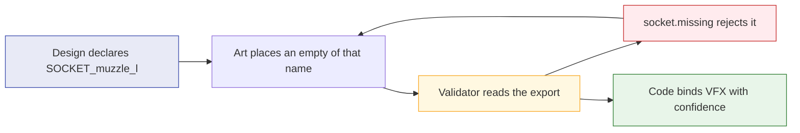
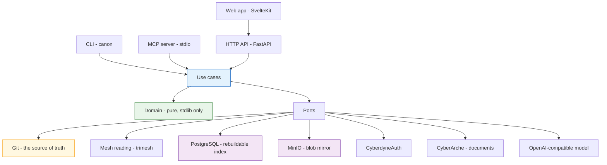
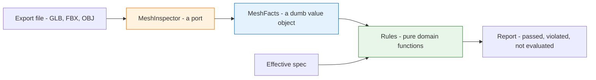
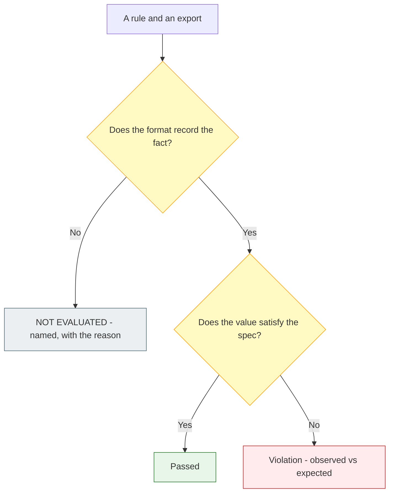
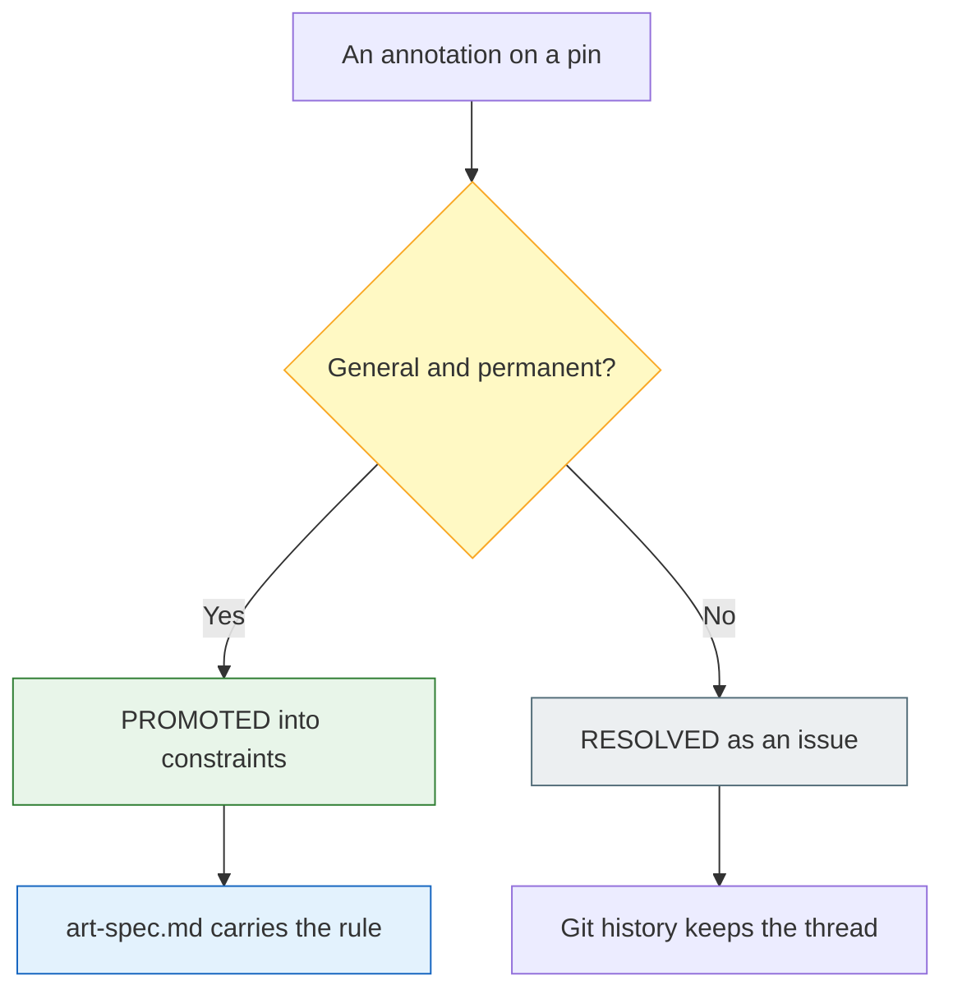
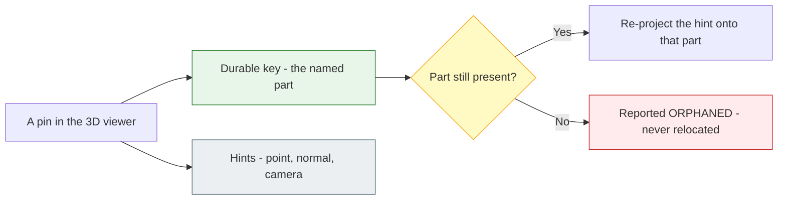
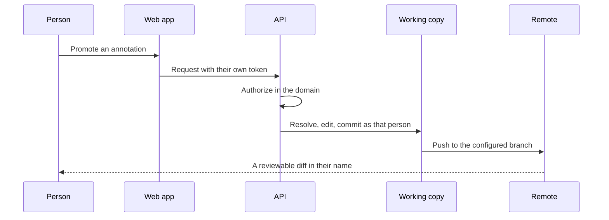
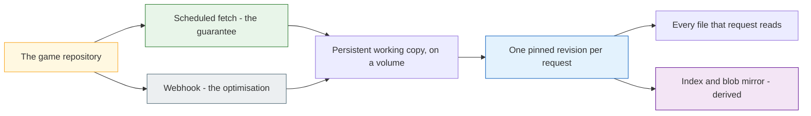
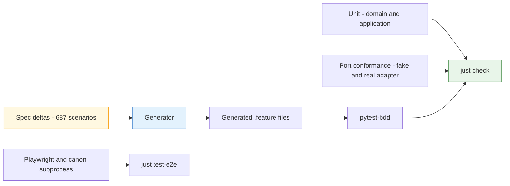

# CyberCanon

**The shared canon of a game project.** Four disciplines work on the same asset
and disagree about it in four different places — a Discord thread, a Blender
scene, a spreadsheet, somebody's memory. CyberCanon gives them one place: a
single versioned contract per asset, and the surfaces to argue about it.

| Who | What they do here |
|---|---|
| **Game designers** | Write what an asset must *do* — its role, its states, the sockets its VFX needs — in fields that constrain art and code rather than in a wiki nobody opens. |
| **Concept artists** | Bring views in, versioned by git; see everyone's feedback pinned where it belongs; replace an image without losing the thread on it. |
| **3D artists** | Know the triangle budget, the naming convention and the required clips *before* modelling — and get a yes or no from a validator instead of from a reviewer three days later. |
| **Developers** | Find any asset and what it must satisfy, ask for the ones that do not exist yet, and stop fixing other people's scale and pivot errors. |
| **AI agents** | Read all of it over MCP, in the shape a context window wants. They read constraints; they never write them. |

Concretely, that is: a CLI validator that runs as a pre-commit hook, a local MCP
server, a web application with a 2D model sheet and a 3D viewer, annotation
threads with art-director triage, git-backed versioning of everything authored,
and long-form design documents linked from CyberArche rather than rebuilt.

**One verifiable contract per asset.** What an asset *looks like* (art), what it
*does* (design) and what it *must respect technically* (engineering) are written
down once, in `asset.yaml`, next to the asset in the game repository — and a
validator enforces the technical half before anyone spends three days modelling.

```
$ canon validate characters/mech_scout/exports/SM_mech_scout_LOD0.glb
characters/mech_scout/exports/SM_mech_scout_LOD0.glb
  asset mech_scout | spec characters/mech_scout/asset.yaml | GLB
  1 violation (1 error, 0 warning)
    error  socket.missing  asset mech_scout  subject SOCKET_muzzle_l  observed absent  expected an attachment point named SOCKET_muzzle_l
      mech_scout: design declares socket 'SOCKET_muzzle_l' and the export contains no attachment point of that name

FAILING
$ echo $?
1
```

Three properties hold everywhere, and everything else follows from them:

- **Git is the source of truth.** `asset.yaml` lives in the game repository.
  There is nothing to sync, and `git diff`, `git blame` and pull-request review
  are the version history of your art direction.
- **The validator never requires identity.** No login, no token, no network. A
  tool an artist cannot use off-VPN becomes the enemy on its first bad day.
- **One core, three surfaces.** The pre-commit hook, the MCP tool a Blender
  agent calls and the web "Validate" button run the *same* use case, so
  "it passed on my machine but the site says it failed" cannot happen.

## Where to read more

| | |
|---|---|
| [`ROADMAP.md`](ROADMAP.md) | Milestones, sprint slicing, the gate decisions, and what is deliberately deferred with the trigger that would revive each. |
| [`openspec/project.md`](openspec/project.md) | The binding architecture, the golden rule for the `design` block, the testing strategy, and the gate decisions G1 to G4. |
| [`openspec/changes/`](openspec/changes) | Twelve specified changes — proposal, spec deltas, design decisions and tasks for each. |
| [`examples/ronin/`](examples/ronin) | A complete, validating game repository. |
| [`deploy/README.md`](deploy/README.md) | What deploys, what deliberately does not, and the recovery procedures. |

---

## The problem this solves

Three complaints, in the order they cost money:

1. *"The 3D devs are not aligned with the concept."* Nothing said what the
   concept **meant** in verifiable terms, and nothing checked it before three
   days of modelling were spent. This is the expensive one.
2. *"I do not know where to get the concept or the model."* A lookup problem.
3. Developers fix mechanical defects — scale, rotation, pivot, naming, triangle
   counts — that should never have reached them.

The first is caused by a **missing design contract**. When an artist and a
programmer argue about a silhouette, the tie-breaker is usually a design fact
nobody wrote down: *"it has to read as hostile at 40 metres during combat."*
That fact explains the art rule **and** the triangle budget. Without it, the two
are arguing about taste.

## The closed loop



A designer's requirement becomes a **mechanically enforced gate**. Code never
discovers at integration time that the muzzle VFX has nothing to attach to.

The same loop runs for animation: a declared state `fire` resolves to a required
clip `A_mech_scout_fire`, and an export without it is rejected by name.

And it depersonalises feedback — the linter rejects the file, not the programmer
rejecting the artist.

## Architecture

Hexagonal, with **three inbound adapters over one core**. The pre-commit
validator, the MCP tool an agent calls and the web Validate button are the same
use case; anything else produces the trust-destroying bug this product exists to
prevent.



**The dependency rule** is `domain <- application <- adapters`, enforced by
import-linter rather than by convention. Inbound adapters never import outbound
ones, and the domain imports **no third-party package at all** — a custom
`stdlib_only` contract enforces that, because an enumerated deny-list passes
silently the day someone adds a dependency nobody remembered to list.

**Git is authoritative; PostgreSQL and MinIO are not.** Dropping the index and
rebuilding it from the repository is always a valid recovery, and no write may
reach only the index.

### The boundary most implementations get wrong



**Mesh rules are domain. Mesh reading is a port.** The inspector returns facts;
the domain decides pass or fail. The entire rule suite therefore runs over
hand-built `MeshFacts` with **zero files on disk** — no binary fixtures in git,
no dependency on the extraction library — and swapping `trimesh` for `bpy` later
touches one adapter.

### Three outcomes, not two

A rule **passed**, was **violated**, or **could not be evaluated** because the
export format does not record the fact it reads.



OBJ carries no unit scale, so an OBJ export may well be correctly scaled and
`canon` will not claim otherwise:

```
$ canon validate props/crate/exports/SM_crate_LOD0.obj
props/crate/exports/SM_crate_LOD0.obj
  asset crate | spec props/crate/asset.yaml | OBJ
  no violations
  not evaluated (11) — the export's format does not record the fact each rule reads
    unit_scale.mismatch  needs unit scale  — OBJ carries no unit scale
    up_axis.mismatch  needs up axis  — OBJ carries no up axis
    socket.missing  needs attachment points  — OBJ carries no attachment points
    ...
  4 rules passed
```


Every suppressed rule is printed **by name**,
never as a count — that listing is the only place a wrong capability row is ever
visible. A format that *cannot contain* what the spec requires is different: an
animated asset exported as OBJ is an ordinary error, and the fix is a re-export.

### Annotations have exactly two exits

The guarantee that keeps the system from degrading as it is used:



The compiled briefing carries **rules plus open issues, never the dead archive**.
Measured over a cycle of five annotations all taken to the resolved exit, the
briefing went 714 bytes, then 1194 with five open, then **714 bytes again —
byte-identical**. "Does not degrade with use" is a measurement here, not a claim.

### Anchoring survives a remesh

A pin stored as a triangle index is precise and worthless the moment the mesh is
re-exported — which is exactly when the feedback needs to survive.



The named part is the identity; the point and normal are positioning hints. A
renamed or deleted part yields an explicitly orphaned annotation, never a
silently mis-placed one. No anchor stores a triangle index or barycentric
coordinate, and a test asserts no anchor type can.

## Features

| Area | What it does |
|---|---|
| **Specification** | `asset.yaml` with three authored blocks — concept, design, constraints — a status lifecycle, dual-anchor annotations, and `schema_version` so version skew never blocks a commit. |
| **Validation** | Triangle and LOD budgets, unit scale, up axis, applied transforms, naming templates, required sockets and required animation clips, across GLB, glTF, FBX and OBJ with a per-format capability matrix. |
| **Compilation** | `art-spec.md` — the briefing a contractor, a new hire or a language model is handed. Rules and open issues only, effective values already merged. |
| **Preview** | A decimated, Draco-compressed preview emitted as a by-product of the validation run that already loaded the mesh. The working export is never served to a browser. |
| **Lookup** | `where_is`, listing, and alias-aware ranked search — exact id, name prefix, alias, tag, description — with zero-result queries logged so the misses tell you which aliases to add. |
| **Agent access (MCP)** | Eight read tools over stdio, four discipline lenses, identity from the credential and never from an argument. No write tool, no promotion tool. |
| **Concepts** | Upload views, committed and attributed; git-backed revision history; compare revisions; annotations carried or explicitly orphaned across a replacement. |
| **Collaboration** | Annotation authoring and threads, the 2D model sheet with pins and stylus support, art-director triage, and the 3D viewer with orbit, polygon counts, animation playback and anchor re-projection. |
| **Documents** | Long-form design documents live in **CyberArche** and are linked, never mirrored — including its own revision history, surfaced rather than copied. |
| **Search** | Exact lookup stays local and deterministic; prose queries are delegated, and results are presented in two labelled groups so approximate is never mistaken for exact. |
| **Derived metadata** | OpenAI-compatible vision proposes aliases for a person to accept. Generated content lives only in the rebuildable index and never reaches `asset.yaml` or the briefing. |
| **Hosting** | FastAPI over a persistent working copy per project, PostgreSQL index, MinIO mirror, CyberdyneAuth, deployed to Coolify. |

**Every optional integration degrades to absent.** With `CANON_LLM_ENABLED` or
`CANON_ARCHE_ENABLED` unset — the defaults — every other capability answers
byte-identically and the optional features report themselves unavailable, naming
the reason.

## How a write reaches the repository



Write-back is a **direct commit** authored as the acting person through
`.canon/actors.yaml`, not a service account. A person with no mapped git
identity is refused, naming the missing entry — because git is the source of
truth, every person has two identities, and leaving them unlinked breaks
attribution silently six months into the history.

## GitHub, and what it is actually doing

Two repositories, doing two completely different jobs. Confusing them makes
everything below unreadable.

| Repository | What it holds | What the git host is to it |
|---|---|---|
| **A game repository** — one per project, named by `CANON_REPOSITORY_URL` | `asset.yaml`, concept views, `art-spec.md`, `.canon/` — the canon itself | **the database.** CyberCanon reads it and writes to it at runtime. |
| **This repository** — [`CyberdyneCorp/CyberCannon`](https://github.com/CyberdyneCorp/CyberCannon) | the tool | an ordinary source host: pull requests, CI, the published pre-commit hook. |

The first row is the unusual one, and the rest of this section is its
consequences.

### The game repository is the database

There is no ORM, no migration and no sync job, because there is nothing to sync
*to*. `git diff` is the changelog of your art direction and `git blame` answers
who tightened the triangle budget and when — not as a nice side effect, but as
the only copy. PostgreSQL and MinIO are derived: destroy both, rebuild from the
repository, and every answer is identical. That is a drill, not an aspiration —
[`docs/recovery.md`](docs/recovery.md) destroys the working copy, the index and
the blob mirror and compares every answer before and after.

So the product's durability question is not *"is our database backed up"*. It is
*"is your game repository backed up"*, which it already was.

### Reading: a working copy, pinned to a revision



Three properties, each bought on purpose:

- **The scheduler is the guarantee; the webhook is only an optimisation.** A
  notification shortens the wait between a commit landing and the working copy
  seeing it. It is never the *reason* the copy is current, because webhooks are
  lost, misconfigured and silently disabled by repository administrators — and a
  project that was quietly hours stale with nothing reporting it is the failure
  this arrangement exists to refuse.
- **Reads come from the git object database at a pinned revision, never from the
  checked-out tree.** A multi-file read is assembled from one revision by
  construction, so a fetch landing mid-request cannot produce a torn read. That
  is structural, not a lock somebody has to remember to take.
- **A project still cloning says `provisioning`.** An empty asset list is
  forbidden as an answer, because "still cloning" and "this project has no
  assets" look identical to a caller and mean opposite things.

**Rejected: reading through the host's REST API.** It would remove the volume,
and add rate limits, per-read latency, a hard dependency on the host being up,
and a second `SpecStore` implementation that would behave differently from the
local one — reintroducing precisely the *"it passed on my machine but the site
says it failed"* bug that one-core-three-surfaces exists to prevent.

### Writing: a direct commit, in your name

A write-back is a **direct commit to a configured branch**, authored as the
person who asked for it. Not a pull request, and not a service account.

| Rule | Why |
|---|---|
| One logical edit is one pushed commit | A commit that cannot be pushed **did not happen** — there is no local-only state to reconcile later. |
| A rejected push retries against the new tip | The remote advancing is an ordinary race, not an error for a person to see. |
| Conflict state that cannot be *determined* is refused | The check used to return "no" on error. A write that fails open on an unreadable working copy is how a conflict marker gets committed. |
| A person with no git identity is refused | Named, not substituted: `<subject> has no entry in .canon/actors.yaml, so an edit cannot be attributed to a git identity; add them to the mapping`. |

The last one is the one people argue about, so it is worth stating plainly:
committing somebody's edit under a shared bot identity is exactly how `git blame`
stops answering the question this whole tool exists to answer. **No mapping, no
write.**

The product does not open a pull request for you. Because the target branch is
configuration, a project that wants review before `main` points
`CANON_REPOSITORY_BRANCH` at a branch that is not `main` and reviews the diff
there; nothing in the product changes either way.

### Every person has two identities, and one file joins them

CyberdyneAuth knows a **subject**. Git knows an **email**. `.canon/actors.yaml`
lives in the game repository and is the join — versioned, reviewable, and part
of the project rather than of the deployment.

```yaml
# .canon/actors.yaml, in the game repository
actors:
  - subject: "<the identity provider's subject for this person>"
    display_name: Leo Test
    emails: [leo@example.com]      # load-bearing: commits are authored with the first
    default_role: ART_DIRECTOR     # descriptive, NOT a grant
```

`emails` is what makes a write possible; an entry with an empty list is refused
exactly like a person with no entry at all. `default_role` is **not** an
authorization grant — a caller's roles come from the `roles` claim in their
token and the mapping is never merged into them. It describes a past commit
author when history is displayed, which is a different question from *what may
this caller do right now*.

### The webhook

`POST /hooks/repository` — deliberately outside the versioned `/v1` prefix,
because the versioned surface is a promise to *our* clients about *our*
resources, and this is an inbound hint from a third party whose payload we
barely read.

```
X-Canon-Signature: sha256=<hmac-sha256 of the exact bytes received>
{"project": "ronin", "ref": "refs/heads/main"}
```

An HMAC over the body rather than a bearer token in a header, because the body
is what is being attested: a token proves somebody knows the token, a digest
proves *this notification* came from somebody who does. Four outcomes, and each
one is specified rather than convenient:

| Case | What happens |
|---|---|
| Authenticated, configured project, its branch | Refresh now. `202` |
| **Unauthenticated** | **Ignored.** No refresh, no retry, no queue — the origin check is the only thing between this and anybody making the service fetch on demand. |
| Unknown project, or a branch we do not serve | Accepted and discarded, `202` — an error here would make the host start disabling the hook, and the projects that *are* configured would lose their optimisation over one that never existed. |
| A body naming no project | Unreadable — reported rather than silently discarded. |

**The secret is required to boot.** `CANON_WEBHOOK_SECRET` is in the required
set, so a hosted service started without it refuses and names it. The adapter
itself can mount no endpoint at all — `register()` accepts `None` — but the
hosted composition root always supplies a secret, so that branch belongs to
other wirings and to tests rather than to a deployment. What an unset or empty
secret must never become is an *open* endpoint, and it cannot: a secret that is
empty authenticates nothing.

*Practical note:* the payload shape above is ours, not GitHub's. A GitHub push
event sends `X-Hub-Signature-256` and a body with `repository.name` instead of
`project`, so pointing a raw GitHub webhook at this endpoint yields
*unauthenticated* and then *unreadable*. A deployment that wants push
notifications needs a small relay that signs our shape.

Until one exists, the right configuration is a **random secret nobody holds**.
Every notification then fails the origin check and is ignored, staleness stays
bounded by `CANON_FETCH_INTERVAL_S`, and there is no window in which an unsigned
caller can make the service fetch on demand. Nothing is lost by this: the
scheduled fetch is the guarantee, and the webhook only ever shortened the wait.

### The credential

| Variable | What it is |
|---|---|
| `CANON_REPOSITORY_URL` | The remote, **carrying the token** — e.g. `https://x-access-token:<PAT>@github.com/<org>/<repo>.git`. This is what git authenticates with. |
| `CANON_REPOSITORY_CREDENTIAL` | The same token, declared separately. **Nothing authenticates with it.** |
| `CANON_REPOSITORY_BRANCH` | The branch write-backs are committed to. |
| `CANON_FETCH_INTERVAL_S` | How often the scheduled fetch runs. |
| `CANON_WEBHOOK_SECRET` | What a notification is signed with. **Required** — the service refuses to start without it. A value nobody holds is the correct setting until a relay exists. |
| `CANON_WRITE_BACK_TIMEOUT_S` | How long one write-back may take before abandoning itself, resetting the working copy and reporting that **no change was recorded**. |
| `CANON_DRAIN_WINDOW_S` | How long a retiring instance may drain. **Must be longer than the timeout above**, so an accepted write-back either finishes or is abandoned before termination. |

`CANON_REPOSITORY_CREDENTIAL` exists to be *known*, not used: declaring the token
is what makes it one of the strings scrubbed from every rendered message, log
line and traceback. Setting both scrubs it twice — once bare, once inside the
URL. One consequence worth expecting rather than debugging: because the URL is
itself a secret, a git failure will not name the repository.

### It is git, not GitHub

Nothing in the product branches on the host. The `RepositoryHost` port speaks
ten plain git operations — clone, fetch, head, read at a revision, commit as an
author, push, list paths, history of one path, recover — and the end-to-end stack
runs the whole system against a bare `git://` daemon in a container, with no
GitHub anywhere. GitLab, Gitea or a bare remote work by construction.

GitHub is where we happen to run it, and the one place a host-shaped assumption
could have crept in — the webhook — is the one place it deliberately did not.

### GitHub for *this* repository

Ordinary, with one rule: **CI runs `just` recipes and nothing else.**

```yaml
- name: just check      # unit, BDD, conformance, both traceability gates, lint, imports, spec
- name: just test-e2e   # browsers and the compose stack, which the run brings up itself
```

A check that lives in the workflow file is a check a developer's `just check` can
never reproduce, so `tests/tooling/test_ci_workflow.py` fails the build if one
leaks in. The two jobs run independently, so a slow e2e job never delays the
verdict on `check`. A failing e2e run uploads its traces as an artifact — that is
evidence, not a check.

This repository also **publishes** the pre-commit hook that game repositories
install ([`.pre-commit-hooks.yaml`](.pre-commit-hooks.yaml)), which is the
lightest possible integration: a game repository adopts CyberCanon by adding
four lines of YAML, and rolls back by deleting them.

## Install

```sh
uv tool install cybercanon     # or: uv sync, inside this repository
canon --help
```

## The four commands

| Command | What it does |
|---|---|
| `canon validate EXPORT...` | Validate exports against the specification that governs them. |
| `canon check [PATH]` | Check that the specification files are themselves valid. |
| `canon compile SPEC` | Compile `asset.yaml` into the readable `art-spec.md`. |
| `canon changed FILE...` | Validate only the assets a list of changed files belongs to — the pre-commit entry point. |

Four more maintain the derived index and the people behind the names:

| Command | What it does |
|---|---|
| `canon index rebuild [PATH]` | Rescan the specifications, reporting how many assets were indexed and naming every file it could not read. |
| `canon index misses` | The search terms that matched nothing, recorded locally and never transmitted. |
| `canon actors unmapped [PATH]` | The git authors and recorded owners `.canon/actors.yaml` does not bind yet. |
| `canon mcp serve [PATH]` | The agent server, over standard input and output. |

Four more exist only because **writes need an identity** — and nothing above
does:

| Command | What it does |
|---|---|
| `canon login` | Sign in by approving a device authorization in a browser. No secret is typed, and none is printed. |
| `canon logout` | Remove the credential this machine stored. Twice is not an error. |
| `canon whoami` | Who this machine writes as, whether it may write at all, and how many reported outcomes are still undelivered. |
| `canon report flush` | Deliver the outcomes the local outbox is holding. Exits zero when the destination is unreachable. |

The credential lives in the operating system's credential store — never in a
file, never in the repository, never in an agent client's configuration — and
`canon login` once per machine serves both the command line and the agent
server. `canon auth login|logout|status` are the same operations under their
original names.

Four more propose search terms for an asset and let a person take them. They are
**optional by construction**: with `CANON_LLM_ENABLED` unset — the default —
they exit `0` saying the feature is unavailable, and nothing else changes.

| Command | What it does |
|---|---|
| `canon describe ASSET [--slot NAME]` | Generate a description, tags and suggested aliases for an asset's concept views. An unchanged image is reused and costs no model call. |
| `canon suggest-aliases ASSET` | The same generation, shown as the proposals waiting for a person. Nothing is written. |
| `canon accept-alias ASSET VALUE --image HASH [--as EDITED]` | Write one accepted alias into `asset.yaml`, committed in your name. The file carries no marker of where it came from, because the value is yours now. |
| `canon reject-alias ASSET VALUE --image HASH` | Refuse one suggestion for one image. It is never offered again for that image, and nothing is written. |

Generated content lives only in the rebuildable index, keyed by the content hash
of the image it was generated from. It never reaches `asset.yaml` and never
reaches the compiled `art-spec.md` — the briefing people and agents read stays
human-authored, and a search rescued by an unaccepted suggestion says so.

## Long-form documents live in CyberArche, and are linked

The prose an asset needs — rationale, exploration, the argument that led to a
constraint — belongs in a document, not in `asset.yaml`. CyberCanon does not
rebuild an editor for it: a document lives in **CyberArche**, and an asset (or
the project) carries a **reference** to it. The reference is five fields in the
specification file, versioned by git like everything else authored there, and
the body, the history and the comments stay where they are.

The web application shows each asset's links with the title resolved under the
**viewer's own credential**, so a document somebody may not read is shown as
inaccessible carrying no title and no summary, and a platform that is down is a
different line from a document that is gone. Over HTTP:

| Request | What it does |
|---|---|
| `GET /v1/projects/{project}/assets/{asset}/documents` | This asset's links and its project's, each with its scope, its state and its resolved title. |
| `POST /v1/projects/{project}/assets/{asset}/documents` | Create an empty pre-titled document for this asset at the platform and link it, in one action. |
| `PUT /v1/projects/{project}/assets/{asset}/documents/{document}` | Link a document that already exists. Nothing is fetched. |
| `DELETE /v1/projects/{project}/assets/{asset}/documents/{document}` | Remove the reference. The document is never modified or deleted. |
| `GET /v1/projects/{project}/assets/{asset}/documents/{document}/revisions` | The document's own version history, read from the platform and never copied. |

A search over a project answers in two labelled groups: the **exact** matches
the local cascade found, and — when the query is prose and nothing matched
exactly — the **approximate** passages CyberArche's per-workspace retrieval
returned, each naming its source document. Exact results always come first and
nothing ranks one kind against the other.

**The whole integration degrades to absent.** With `CANON_ARCHE_ENABLED` unset —
the default — every other capability answers byte-identically, stored references
are still listed and openable as plain addresses, and the linked-document
features report themselves unavailable and name the reason.

You never name the specification: given any path, `canon` walks upward to the
governing `asset.yaml`, bounded by the repository root.

**Exit codes are stable and scriptable:**

| Code | Meaning |
|---|---|
| `0` | The operation ran and produced no `error`-severity violation. |
| `1` | The operation ran and produced at least one `error`-severity violation. |
| `2` | The operation could not run at all — a missing export, an unreadable file, a format outside the matrix, or no `asset.yaml` above the path. |

`2` is deliberately distinct from `1`: *"your mesh is wrong"* and *"I could not
look at your mesh"* are different sentences, and a hook that conflated them would
send an artist to fix an export nobody read.

**`--json` on any command** writes the structured result to standard output and
nothing else; prose, diagnostics and failures go to standard error. Violations,
not-evaluated rules and the export format are distinct fields, because a script
that confuses *failed* with *never ran* is worse than one that has neither.

## Use it as a pre-commit hook

```yaml
# .pre-commit-config.yaml, in the game repository
repos:
  - repo: https://github.com/CyberdyneCorp/CyberCannon
    rev: v0.1.0
    hooks:
      - id: canon
```

```sh
pre-commit install
```

The hook receives the staged files and validates only the assets they belong to.
A commit that touches no asset exits `0` without doing any work, so a repository
that has not adopted `asset.yaml` yet is unaffected. Adoption is additive;
rollback is deleting the hook.

## The worked example

[`examples/ronin/`](examples/ronin) is a complete, validating game repository:

```
examples/ronin/
  .canon/project.yaml                        project defaults and standing rules
  characters/mech_scout/asset.yaml           the contract
  characters/mech_scout/art-spec.md          the compiled briefing (derived)
```

`mech_scout` is skinned and animated, declares an attachment point, two design
states and a rig budget, and every rule it can be measured against passes. Its
`art-spec.md` is what a contractor, a new hire or a language model is handed:
rules and currently open issues, with effective values already merged — never a
paraphrase, never a resolved thread.

The closed loop the whole system exists for is visible in it:

> design declares `SOCKET_muzzle_l` → art places an empty with that name →
> `socket.missing` rejects the export without it → code never discovers at
> integration time that the muzzle VFX has nothing to attach to.

## `asset.yaml`

```yaml
schema_version: 1
id: mech_scout
name: Scout Mech
status: modeling          # concept -> approved -> modeling -> validated -> in-engine

concept:                  # authored by art
  views: [concept/mech_scout_front.png]
  silhouette_rules: ["One asymmetric shoulder reads as the front at 25 m."]

design:                   # authored by design
  role: fast recon walker
  read_distance_m: 25
  sockets:
    - name: SOCKET_muzzle_l
      purpose: muzzle flash origin
  states:
    - { name: walk, loop: true, root_motion: true }
    - { name: fire, loop: false }

constraints:              # authored by engineering
  tri_budget: 12000
  lods: [12000, 6000, 2000]
  rig: { skeleton: SK_MechScout, skinned: true }
```

**The golden rule for the `design` block:** every field either constrains art,
constrains code, or is checkable by the validator. A field that does none of the
three is a wiki page, not a spec field. `states` earns its place because it
resolves into *required clips* the export must contain.

**An unknown field is a warning, not a failure.** A newer CyberCanon writing a
field your binary has never heard of must not block your commit. Only a *newer
major* `schema_version` is refused, and the message names the version you need.

## `.canon/project.yaml`

Project defaults, merged field by field with each asset's own `constraints` —
the asset wins wherever it declares something. The merge happens once, before
any rule runs, and the compiled `art-spec.md` states the same merged values the
validator enforces, so the briefing and the contract cannot drift.

```yaml
schema_version: 1
name: Ronin
engine_content_root: Content/Ronin        # where the imported asset lives
golden_rules:
  - The silhouette reads at 25 m before any detail does.

defaults:                                 # an ordinary `constraints` block
  up_axis: Y
  unit_scale: 1.0
  pivot: feet centre
  naming: "SM_{asset}_LOD{n}"             # a template, never a regex
  animation:
    frame_rate: 30
    clip_naming: "A_{asset}_{state}"      # how a state resolves to a clip name
  rig:
    max_bones: 64

severity:                                 # per rule, per project
  naming.pattern_mismatch: warning

preview:                                  # decimation targets
  ratio: 0.25
  ceiling: 20000
```

| Key | Meaning |
|---|---|
| `defaults.naming` | Object naming template. `{asset}` and `{n}` (the LOD index) are expanded. |
| `defaults.animation.clip_naming` | How a design state resolves to a clip name. Without it, a state must declare `clip:` or `animated: false`. |
| `defaults.animation.frame_rate` | The rate clips are expected at, unless a state overrides it. |
| `defaults.rig.max_bones` | The bone budget `rig.bone_budget_exceeded` enforces. |
| `defaults.up_axis`, `defaults.unit_scale` | The export conventions, checked wherever the format records them. |
| `engine_content_root` | Where the engine keeps imported content, for the people who have to find it. |
| `severity.<rule_id>` | Lower a noisy rule to `warning`, or promote it to `error`, without editing the rule. |
| `preview.ratio`, `preview.ceiling` | What preview decimation aims for. A preview never changes a verdict. |

A repository with no `.canon/project.yaml` works: every asset-level declaration
still applies.

## Read it from an agent (MCP)

`canon mcp serve` starts a local server over standard input and output. It opens
no port, and every read needs no credential and no network: reads degrade to a
local unauthenticated actor, so an agent answers *where is the mech scout and
what must it satisfy* on a laptop off the VPN.

Point an agent client at the repository. The launch entry is the whole
configuration, and it holds **no credential**:

```json
{
  "mcpServers": {
    "cybercanon": {
      "command": "canon",
      "args": ["mcp", "serve", "."],
      "env": { "CANON_AGENT": "blender-agent" }
    }
  }
}
```

The final argument is the project directory; `.` serves the repository the
client spawned the process in. `just mcp` starts the same server by hand.

`CANON_AGENT` names the agent at the other end, and it is a name rather than a
secret: it is the second half of every attribution — *"rafa, via
blender-agent"* — and it is read from this configuration and from nowhere else,
never from a tool argument. A server started without it keeps every read and is
refused both writes, naming the missing identifier. Identity is the other half:
a person runs `canon login` once on the machine, and the server writes as that
person.

Eight read tools, and there are deliberately no others:

| Tool | Answers |
|---|---|
| `where_is` | Directory, source file, latest validated export, engine path, links, status, owners. |
| `list_assets` | A compact table of the project's assets, filtered by status, owner or tag. |
| `search_assets` | Identifier, name, alias, tag and description, ranked in that order. |
| `get_asset_spec` | The compiled specification, optionally through a `lens`. |
| `get_constraints` | What an export must satisfy, including its required sockets. |
| `get_open_annotations` | The threads still open. Resolved and promoted ones are absent. |
| `diff_spec` | How the contract has moved since a revision, in semantic terms. |
| `validate_export` | The same verdict `canon validate` produces, from the same use case. |

**A lens narrows presentation and never widens access.** Identity comes from the
credential the process was launched with, never from a tool argument, and a
lensed answer says which lens produced it and that a full specification exists.

And exactly two write tools, which are proposals rather than edits:

| Tool | Records |
|---|---|
| `add_annotation` | An observation against an asset — typically that a declared constraint cannot be met, and why. It is appended to the asset's `asset.yaml` in the working copy and **not committed**, so a person reviews an ordinary diff. |
| `report_export` | The outcome of a validation the local validator already produced. The verdict stands whether or not the report is ever delivered; an undeliverable one waits in `.canon/reports.ndjson` (git-ignored) for `canon report flush`. |

**There is no promotion tool — in this version or any future one, and not for an
art director's agent either.** Promotion turns an annotation into a durable
constraint; an agent that could raise a budget until its own output passed is
how trust in the system dies in week two. An agent records that the budget is
unreachable and the budget does not move; a person promotes the observation into
a rule, or resolves it as an issue, and the resulting rule is attributed to that
person. An agent cannot close its own observation either.

Every agent-authored annotation is marked as agent-authored wherever a human
reads it — the open threads, the compiled `art-spec.md`, the specification diff
— so nobody has to guess whether a machine wrote a line. An exact-match test
over the advertised tool names fails the build when anything is added to either
half of the surface.

## Tell repo-reading agents the specifications exist

Not every agent speaks MCP, and the file is already in the repository the agent
reads. One section in the game repository's `CLAUDE.md` is the whole
integration — [`examples/ronin/CLAUDE.md`](examples/ronin/CLAUDE.md) is the
snippet, ready to copy:

```markdown
Every asset in this repository has a specification next to it —
`<asset directory>/asset.yaml` — compiled to a readable `art-spec.md`, with
project-wide defaults in `.canon/project.yaml`. Read it before changing,
exporting or describing an asset. Agents read constraints; agents never write
constraints.
```

## Testing

Four layers, and the specifications are the source of two of them:



**Nobody hand-writes a `.feature`.** They are generated from the spec deltas and
regenerated in CI, so a hand edit cannot survive. Two gates fail in opposite
directions: a requirement with no executing scenario fails, and a generated
scenario with no step definition fails, naming the spec file and line. One gate
alone is satisfiable by cheating; together they pin the spec and the code to each
other.

*Known limitation:* the gate counts only Python step definitions, so a frontend
scenario implemented and tested in TypeScript still reads as pending. Read
"0 absent" as "nothing is hidden", not as "everything is verified".

## Developing CyberCanon

There is exactly one way to run any operation, and it is a `just` recipe:

```sh
just setup     # uv sync from the committed lock file
just check     # everything CI runs, in CI's order — and nothing else
just test      # unit + BDD + conformance + integration, with both traceability gates
just lint      # ruff
just imports   # the layering contract: domain <- application <- adapters
just spec      # openspec validate --all --strict
```

`just check` is the contract: a green local run means a green pipeline. The
architecture, the decisions behind it and the specifications live in
[`openspec/`](openspec) — start with
[`openspec/project.md`](openspec/project.md).
